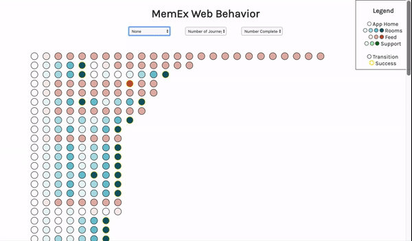

# rex-project

This app was created as part of an interview for the Rex team. It is a rough vizualization of member behavior on our Member App.

## Preview



Currently filtering is live for the journeys, and filters are built for the number of journeys and the number of successes in a session.

The data was pulled from the playground_memex.app_sessions_sample table from Redshift and saved to the app as a csv. 
Because the session_uuid in the table turned out to not be unique to a single user, I ended up concatonating the session_uuid and user_uuid to create a unique identifier per session.

```WITH numAction as (
SELECT CONCAT(session_uuid, user_uuid) AS session, COUNT (session) as numActions
FROM playground_memex.app_sessions_sample
GROUP BY session_uuid, user_uuid
),

numJourneys as (
SELECT CONCAT(session_uuid, user_uuid) AS session, COUNT (session) as numJourneys
FROM playground_memex.app_sessions_sample
WHERE event_name = 'app_home'
GROUP BY session_uuid, user_uuid, event_name
),

numRooms as  (
SELECT CONCAT(session_uuid, user_uuid) AS session, COUNT (session) as numRooms
FROM playground_memex.app_sessions_sample
WHERE journey_name = 'rooms'
GROUP BY session_uuid, user_uuid, journey_name
),

numFeed as  (
SELECT CONCAT(session_uuid, user_uuid) AS session, COUNT (session) as numFeed
FROM playground_memex.app_sessions_sample
WHERE journey_name = 'feed'
GROUP BY session_uuid, user_uuid, journey_name
),

numSupport as  (
SELECT CONCAT(session_uuid, user_uuid) AS session, COUNT (session) as numSupport
FROM playground_memex.app_sessions_sample
WHERE journey_name = 'support'
GROUP BY session_uuid, user_uuid, journey_name
),

numSuccess as  (
SELECT CONCAT(session_uuid, user_uuid) AS session, COUNT (session) as numSuccess
FROM playground_memex.app_sessions_sample
WHERE event_type = 'success'
GROUP BY session_uuid, user_uuid, event_type
)

SELECT p.*, CONCAT(p.session_uuid, p.user_uuid) AS session_cleaned, a.numActions, j.numJourneys, r.numRooms, f.numFeed, s.numSupport, t.numSuccess
FROM playground_memex.app_sessions_sample as p
LEFT JOIN numAction as a
ON a.session = CONCAT(p.session_uuid, p.user_uuid)
LEFT JOIN numJourneys as j
ON j.session = a.session
LEFT JOIN numRooms as r
ON r.session = a.session
LEFT JOIN numFeed as f
ON f.session = a.session
LEFT JOIN numSupport as s
ON s.session = a.session
LEFT JOIN numSuccess as t
ON t.session = a.session
ORDER BY session_cleaned, user_uuid, t
LIMIT 800```
