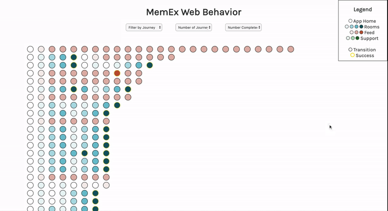

# rex-project

This app was created as part of an interview for the Rex team, to create a vizualization of member behavior on our Member App. Each horizontal stream of bubbles represents a "session", or the behavior a user engaged in while the Member App was open. Within the member app, a user can engage in a number of activities that we'd consider "completion" including booking a conference room, logging a support ticket, or interacting with the feed. In order to complete these actions, a user must navigate through a number of pages within the app. In order to track this, we've described these series of pages as a "journey". For example, before booking a conference room a user must visit the rooms_home page, may engage in the rooms_scroll page,  must visit the rooms_detail page, and finally reach the rooms_reservation action. 

Within the app, different journeys are represented by different color gradients, and the saturation of the color represents progress within the journey, where actions closer to the completion action are darker and actions earlier in the journey are lighter. Once a user reaches the completion action, the border of the bubble goes from black to gold.

On hover, the app will show more information on the action and the engaged user.

## Preview



### Goals of the project

When considering what to build, I decided to approach it as something that could help our UX designers and user researchers to identify points of friction or places that members might be taking more steps than necessary to complete their journeys. 

Some of the specific questions I looked to answer were:
1. Where are users backtracking when approaching a completion action (demonstrated by the stream of bubbles getting darker, then lighter again)?
2. Where are users dropping off in the midst of a journey (demonstrated when a stream of bubbles does not end in a gold-circled bubble, but a black one)?
3. How similar is user behavior when on a specific journey (demonstrated by being able to sort by journey)?

The application allows you to filter by:
1. If a user has engaged in a specific type of journey
2. How many journeys a user has engaged in, at a minimum (eg: if filtering by 2, you are showing users that have engaged in at least 2 journeys)
3. How many journeys a user has completed, at a minimum (eg: if filtering by 2, you are showing users that have completed at least 2 journeys)

### Getting the project locally
Dependencies: npm
1. Clone repository locally
2. `npm install`
3. `npm run build`
4. `npm run start`


### Source of the Data

The data was pulled from the playground_memex.app_sessions_sample table from Redshift and saved to the app as a csv. 
Because the session_uuid in the table turned out to not be unique to a single user, I ended up concatonating the session_uuid and user_uuid to create a unique identifier per session.

```WITH numAction as (
SELECT CONCAT(session_uuid, user_uuid) AS session, COUNT (session) as numActions
FROM playground_memex.app_sessions_sample
GROUP BY session_uuid, user_uuid
),

numJourneys as (
SELECT CONCAT(session_uuid, user_uuid) AS session, COUNT (session) as numJourneys
FROM playground_memex.app_sessions_sample
WHERE event_name = 'app_home'
GROUP BY session_uuid, user_uuid, event_name
),

numRooms as  (
SELECT CONCAT(session_uuid, user_uuid) AS session, COUNT (session) as numRooms
FROM playground_memex.app_sessions_sample
WHERE journey_name = 'rooms'
GROUP BY session_uuid, user_uuid, journey_name
),

numFeed as  (
SELECT CONCAT(session_uuid, user_uuid) AS session, COUNT (session) as numFeed
FROM playground_memex.app_sessions_sample
WHERE journey_name = 'feed'
GROUP BY session_uuid, user_uuid, journey_name
),

numSupport as  (
SELECT CONCAT(session_uuid, user_uuid) AS session, COUNT (session) as numSupport
FROM playground_memex.app_sessions_sample
WHERE journey_name = 'support'
GROUP BY session_uuid, user_uuid, journey_name
),

numSuccess as  (
SELECT CONCAT(session_uuid, user_uuid) AS session, COUNT (session) as numSuccess
FROM playground_memex.app_sessions_sample
WHERE event_type = 'success'
GROUP BY session_uuid, user_uuid, event_type
)

SELECT p.*, CONCAT(p.session_uuid, p.user_uuid) AS session_cleaned, a.numActions, j.numJourneys, r.numRooms, f.numFeed, s.numSupport, t.numSuccess
FROM playground_memex.app_sessions_sample as p
LEFT JOIN numAction as a
ON a.session = CONCAT(p.session_uuid, p.user_uuid)
LEFT JOIN numJourneys as j
ON j.session = a.session
LEFT JOIN numRooms as r
ON r.session = a.session
LEFT JOIN numFeed as f
ON f.session = a.session
LEFT JOIN numSupport as s
ON s.session = a.session
LEFT JOIN numSuccess as t
ON t.session = a.session
ORDER BY session_cleaned, user_uuid, t
LIMIT 800
